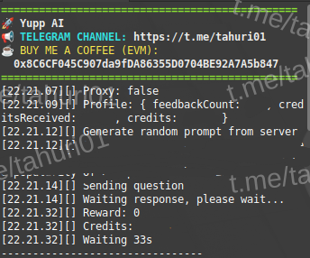

# BOT YUPP



**Fitur:**

**• Random prompt**

**• Auto send question**

**• Supports Proxy w/o Proxy**

## Requirements

Before running this project, make sure you have installed:

- Node.js
- npm (Node Package Manager)

## Installation

1. **Clone this repository:**

    ```plaintext
    git clone https://github.com/wrightL-dev/NYAI
    cd NYAI

2. **Install the required packages:**

    ```plaintext
    npm install axios protobufjs readline ntp-client https-proxy-agent socks-proxy-agent tweetnacl tweetnacl-util

3. **Add your account in the token.txt file. Example:**

    ```plaintext
   eyxxxx

4. **If you want custom prompt edit config.json and pc.js**
   
5. **If you want to use a proxy, edit the proxy.txt file. Example:**

    ```plaintext
   http://username:password@ip:port

6. **Run the script:**
   ```plaintext
   node main.js
   
## Support

If you have any questions or need further assistance, feel free to join our Telegram channel at [t.me/tahuri01](https://t.me/tahuri01).

## License

This project is licensed under the [MIT License](LICENSE).
